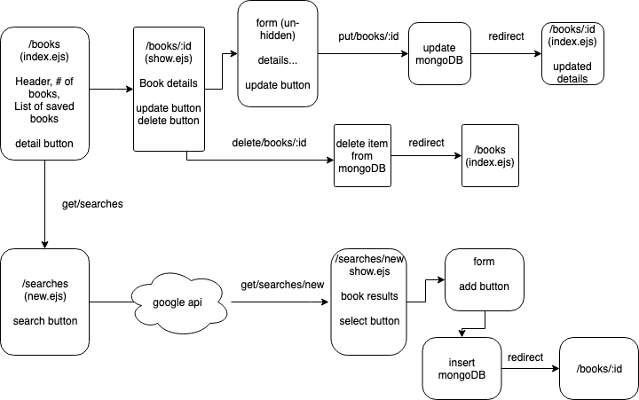

#  LAB

## lab-10-bookapp-v2

### Author: Bonnie Wang

### Links and Resources

- [submission PR](https://github.com/401-advanced-javascript-bw/lab-10-bookapp-v2/pull/1)
- [travis](http://xyz.com)

#### Documentation

- [api docs](http://xyz.com) (API servers)
- [jsdoc](http://xyz.com) (Server assignments)

### Modules

#### `books-model.js`

###### `new Books(schema) -> new book class`

#### `books-schema.js`

###### `schema for books`

#### `bookshelves-model.js`

###### `new Bookshelves(schema) -> new bookshelf class`

#### `bookshelves-schema.js`

###### `schema for bookshelves`

#### `mongo-model.js`

###### `Model.get(_id) -> object`

###### `Model.post(record) -> object`

###### `Model.put(_id, record) -> updated object`

###### `Model.delete(_id)`

### `sql-model.js`

Usage Notes or examples

### Setup

#### `.env` requirements

- `PORT=8080`
- `MONGODB_URI='mongodb://localhost:27017/lab-08'` (mongo)
- `DATABASE_URL=postgres://localhost:5432/books_app` (sql)

#### Running the app

- `npm i`
- `npm start`
- Endpoint: `/`
  - Returns list of saved books.
- Endpoint: `/searches`
  - Returns a search form.
- Endpoint: `searches/new`
  - Returns a new search.
- Endpoint: `/books/:id`
  - Returns result of one book or update/ delete one book
- Endpoint: `/books`
  - Returns creates a new book in the saved collection

#### Tests

- npm test to run tests

#### UML

